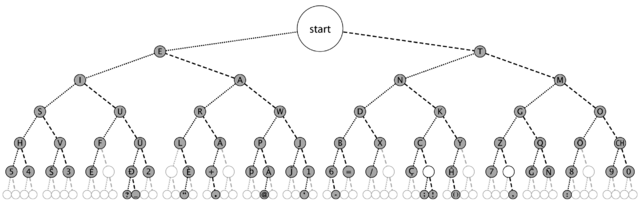

# learning_morse
morse code encoder/decoder

# MORSE CODE

<table>
<tr>
<th>char</th>
<th>char</th>
<th>char</th>
<th>char</th>
<th>char</th>
<th>char</th>
<th>char</th>
<th>char</th>
<th>char</th>
</tr>
<tr>
<td>A .-</td>
<td>B -...</td>
<td>C -.-.</td>
<td>D -..</td>
<td>E .</td>
<td>F ..-.</td>
<td>G -.</td>
<td>H ....</td>
<td>I ..</td>
</tr>

<tr>
<td>J .---</td>
<td>K -.-</td>
<td>L .-..</td>
<td>M --</td>
<td>N -.</td>
<td>O ---</td>
<td>P .--.</td>
<td>Q --.-</td>
<td>R .-.</td>
</tr>

<tr>
<td>S ...</td>
<td>T -</td>
<td>U ..-</td>
<td>V ...-</td>
<td>W .--</td>
<td>X -..-</td>
<td>Y-.--</td>
<td>Z --..</td>
<td>0 -----</td>
</tr>

<tr>
<td>1 .----</td>
<td>2 ..---</td>
<td>3 ...--</td>
<td>4 ....-</td>
<td>5 .....</td>
<td>6 -....</td>
<td>7 --...</td>
<td>8 ---..</td>
<td>9 ----.</td>
</tr>

<tr>
<td>. .-.-.-</td>
<td>: ---...</td>
<td>, --..--</td>
<td>; -.-.-.</td>
<td>? ..--..</td>
<td>= -...-</td>
<td>' .----.</td>
<td>/ -..-.</td>
<td>! -.-.--</td>
</tr>

<tr>
<td>- -....-</td>
<td>_ ..--.-</td>
<td>" .-..-.</td>
<td>( -.--.</td>
<td>) -.--.-</td>
<td>$ ...-..-</td>
<td>& .-...</td>
<td>@ .--.-.</td>
<td>+ .-.-.</td>
</tr>
<tr>
<td>^ -.----.</td>
<td>~ ------.</td>
<td>[ -.--.--</td>
<td>] -.---.-</td>
</tr>
</table>

# MORSE TREE

